<h1 align="center">CyberCypher 👾</h1>

<h3 align="center"><a href="https://shanedoyledev.github.io/cybercypher">➡️ View the live project here ⬅️</a></h3>

 

## Introduction

Cybercypher is a project that builds upon the core concepts of the classic memory card game, but with an intriguing twist! Players assume the role of a computer hacker in a dystopian cyberpunk world, tasked with using their skills to breach a mainframe and access secret data. The objective is to match the correct symbols on a computer terminal, but the challenge is that players have a limited amount of time and attempts to beat the game and achieve their mission.

Players can tailor their gaming experience by selecting from a range of difficulty levels: novice, pro, and elite. Each mode adjusts the number of attempts a player gets and the time allotted to complete the game, ensuring an exciting and replayable experience.

<h3 align="center">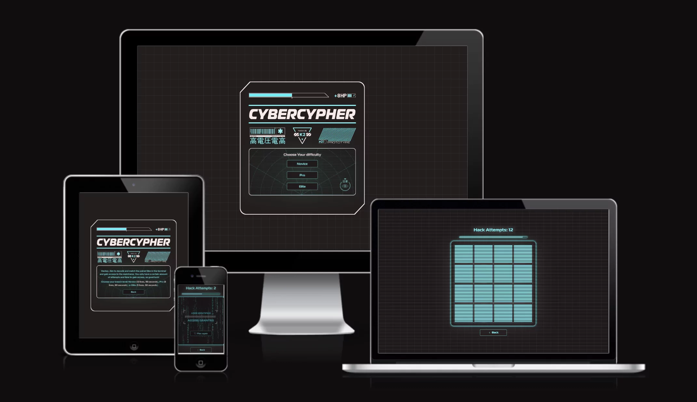</h3>

## Table of Contents

- [User Experience (UX)](#user-experience-ux)
  - [User Stories](#user-stories)
- [Design](#design)
  - [Colour Scheme](#colour-scheme)
  - [Typography](#typography)
  - [Components](#components)
  - [Imagery](#imagery)
  - [Wireframes](#wireframes)
- [Features](#features)
  - [Existing Features](#existing-features)
  - [Future Implementations](#future-implementations)
  - [Accessibility](#accessibility)
- [Technologies](#technologies)
  - [Programming Languages](#programming-languages)
  - [Applications, Plugins & Tools Used](#applications-plugins--tools-used)
- [Deployment & Local Development](#deployment--local-development)
  - [Deployment](#deployment)
  - [Local Development](#local-development)
- [Testing](#testing)
- [Credits](#credits)
  - [Code Used And Tutorials](#code-used-and-tutorials)
  - [Content](#content)
  - [Media](#media)
  - [Acknowledgments](#acknowledgments)

## User Experience (UX)

- ### User stories

  - #### Player Goals

    1. As a player, I want to be able to choose a game difficulty (novice, pro, elite) from the main menu so that I can tailor the game to my skill level.

    2. As a player, I want to see that the game matches the cyberpunk aesthetic and fits with the hacker theme.

    3. As a player, I want a visual timer to be displayed on the screen so that I can see how much time I have left to complete the game.

    4. As a player, I want to know if two tiles match or not, and if they do, I want them to stay revealed.

    5. As a player, I want to see my number of lives displayed on the screen so I know how many attempts I have left.

    6. As a player, I want the game to end and see a game over screen if I run out of lives before completing the game.

    7. As a player, I want the game to end and see a victory screen if I successfully match all the tiles before running out of time or lives.

    8. As a player, I want the option to restart the game from the victory or game over screen so that I can play again.

    9. As a player, I want to see dynamic visual effects to make the experience more immersive.

    10. As a player, I want to be able to access game instructions from the main menu to understand how to play the game.

    11. As a player, I want the ability to return to the main menu from the game screen so that I can change the game difficulty or access instructions.

    12. As a player, I want to be able to play the game on a variety of screen sizes and devices, from large to small.

## Design

- #### Colour Scheme
  ### 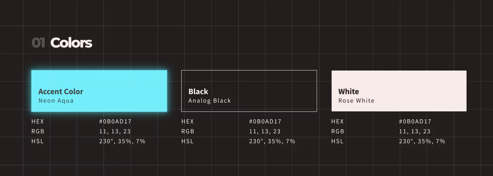
  Inspired by the aesthetics of retro sci-fi, I deliberately opted for a relatively minimalist color palette. I subtly tweaked the black and white values, infusing a subtle hint of red to evoke an analog vibe. The usage of monochromatic cyan values aim to capture the essence of a vintage computer terminal. To enhance these color values and create a neon-like ambiance, I've incorporated glows to align with the sci-fi theme.
- #### Typography
  ### 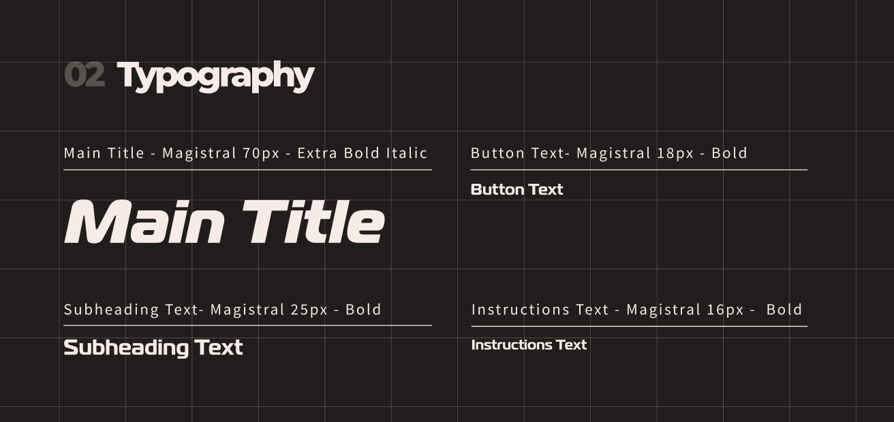
  During my research on 80s sci-fi novels to get visual inspiration, I observed that many book covers featured bold sans-serif fonts that demanded attention. Consequently, I chose the Magistral font from Adobe as the primary typeface for my web app. Its presence greatly contributes to the overall retro scfi atmosphere of the game.
- #### Imagery

  ### 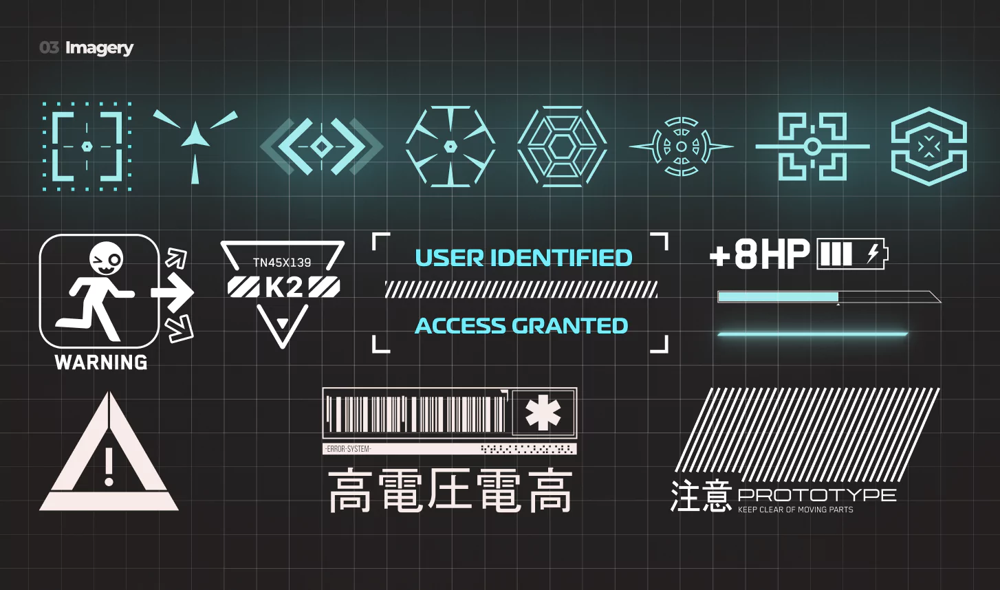

  The icons and design elements draw inspiration from the cyberpunk and sci-fi motifs commonly found in the interfaces of machines and screen UIs, adding a touch of futuristic allure. All images SVG, allowing them to be infginitly scalable and have miniscule file sizes to boost website perfomance and download speeds.

- #### Wireframes

  I started things off by creating the initial website wireframes using Figma. This allowed me to fine-tune the design, play around with images, typography, colors, and layout. I then organized everything into a design system to ensure that all design elements stayed consistent. Once I was happy with the UI/UX design and where the content was placed, I moved on to the coding phase of the project.

     

- Desktop Wireframe - [Figma Link](https://www.figma.com/file/n3bDyFXb9kIYMV0GAdXbIp/CyberCypher?type=design&node-id=39-2&mode=design&t=4NMfb6hGsEAY7c3d-0) / [Screenshot Link](/assets/images/readme/design/desktop-wireframes.webp)

- Tablet Wireframe - [Figma Link](https://www.figma.com/file/n3bDyFXb9kIYMV0GAdXbIp/CyberCypher?type=design&node-id=41-105&mode=design&t=4NMfb6hGsEAY7c3d-0) / [Screenshot Link](/assets/images/readme/design/tablet-wireframes.webp)

- Mobile Wireframe - [Figma Link](https://www.figma.com/file/n3bDyFXb9kIYMV0GAdXbIp/CyberCypher?type=design&node-id=41-106&mode=design&t=4NMfb6hGsEAY7c3d-0) / [Screenshot Link](/assets/images/readme/design/mobile-wireframes.webp)

- Design System - [Figma Link](https://www.figma.com/file/n3bDyFXb9kIYMV0GAdXbIp/CyberCypher?type=design&node-id=35-2&mode=design&t=4NMfb6hGsEAY7c3d-0) / [Screenshot Link](/assets/images/readme/design/design-system.webp)

## Features

### Existing Features

<h3 align="center">Favicon</h3>

### 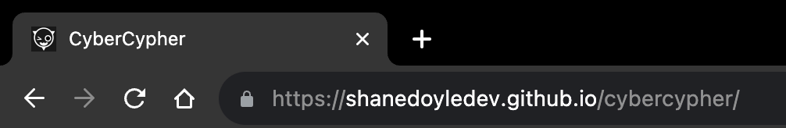

- This is a custom favicon which is present in the browser's tab for the page.

---

 

<h3 align="center">Main Menu Section</h3>

### 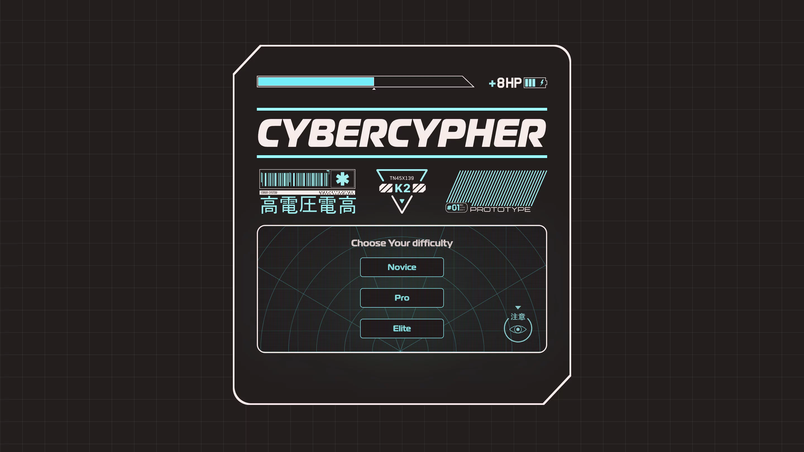

- The Main menu section serves as the main point of entry into the game and is where players can choose from one of three difficulty levels. It serves as a container for all other menu elements.

- It is designed to reflect the look of a machine with cut beveled edges and interface elements like a battery meter and energy bar.

- The title is displayed prominently at the top and is surrounded by cyberpunk design elements to help impart the sci-fi feel of the game.

- The interactive menu at the bottom serves as the "screen" of the device and is where players can start the game and view the instructions.

 

---

 

<h3 align="center">Interactive Menu Section</h3>

### 
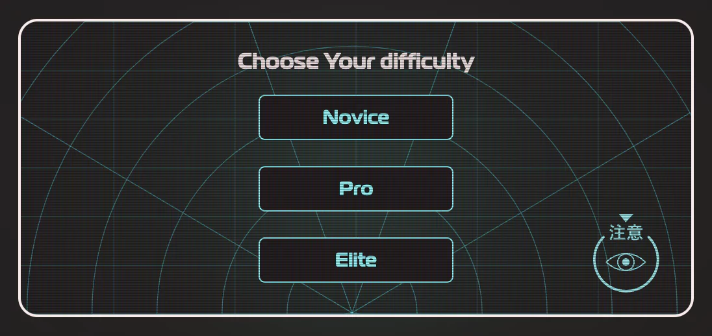

- The interactive menu allows the player to begin the game by selecting one of three modes in increasing levels of difficulty: Novice, Pro, and Elite.

  - **Novice Mode** - Selecting the **Novice** mode starts the game, giving the player **8 lives** and a timer length of **60 seconds**.

  - **Pro Mode** - Selecting the **Pro** mode starts the game, giving the player **8 lives** and a timer length of **60 seconds**.

  - **Elite Mode** - Selecting the **Elite** mode starts the game, giving the player **5 lives** and a timer length of **30 seconds**.

 

---

 

<h3 align="center">Instructions Section</h3>

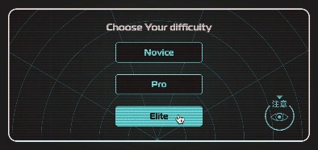

- The instructions are accessed by clicking on the icon with the annotated arrow at the bottom right corner of the interactive menu section.

- When this button is clicked, the screen glitch transitions to reveal the instructions text.

- The back button returns to the interactive menu where players can select the difficulty level.

- The text is responsive and changes size to accommodate the changing width of the menu on a range of screen sizes. I wanted to ensure it could still be readable and not spill out of the sides of the menu width.

 

---

 

<h3 align="center">Countdown Bar</h3>

- The Countdown bar serves as a visual indicator to the player of how much time is remaining in the game. Players must match all tiles before it becomes empty.

- When the bar becomes 75% empty, it begins to flash, adding further feedback to the player.

- The bar scales in proportion to the game grid to ensure that it is clearly visible on all devices and screen sizes.

- It uses CSS animations to impart a neon glow effect, making it feel like an element of digital UI.

 

---

 

<h3 align="center">Life Meter</h3>

- The number of hack attempts (or lives) is shown to the player here.

- If the player fails to match two tiles, then this value will decrement by one point.

- If there are no attempts remaining, then the game will automatically end and display the game over screen.

 

---

 

<h3 align="center">Grid Tile</h3>

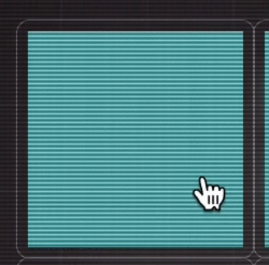

- The grid tile is the interactable element of the game board. Each grid tile is assigned one of 8 random images.

- Each grid tile is given a click event listener which plays a glitch video overlay on click.

- While a tile is active, a CSS class is appended to make it non-clickable to prevent the player from accidentally selecting it a second time.

- When two tiles do not match, they are once again hidden from the player. The click events still remain, and the non-clickable CSS class is removed to allow them to be selected once more.

- When two tiles match, they remain revealed and the click event handlers are removed from them to prevent them from being clicked again for the duration of the game.

 

---

 

<h3 align="center">Game Grid</h3>

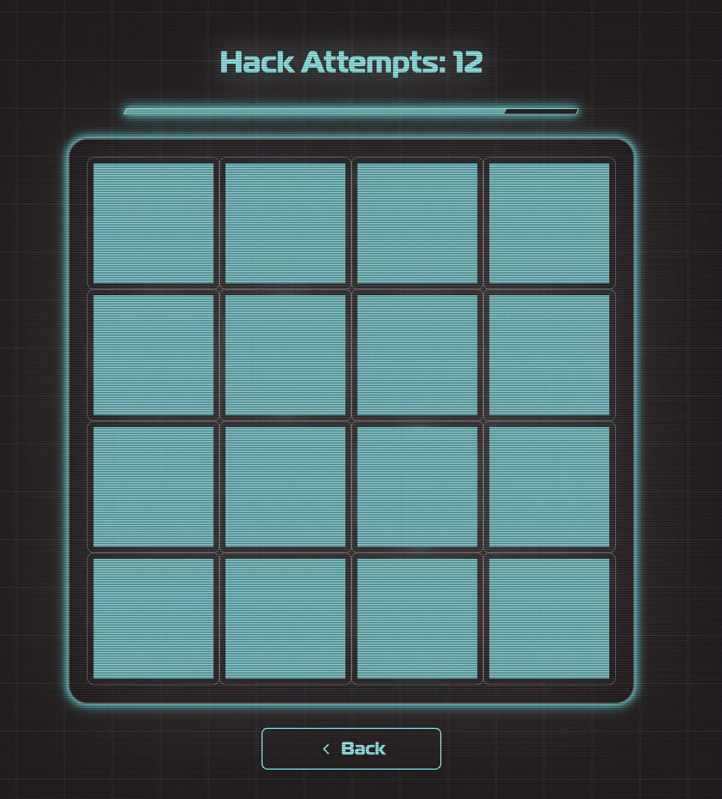

- The game acts as a container for all of the game tiles and renders them in a 4 by 4 grid.

- The grid container is designed to be responsive and allow the grid tiles to shrink and expand fluidly with changes in the viewport size.

- The game grid is used to display either a victory or game over screen depending on if the player is able to complete the game or not.

 

---

 

<h3 align="center">Game Over Screen</h3>

- The game over screen is shown when the player unsuccessfully attempts to match all of the tiles.

- This Screen will be shown if the timer runs out before game completion.

- This Screen will be shown if the player runs out of lives.

- Contains a restart button should the player wish to replay the game without having to exit to the main menu to start a new game.

 

---

 

<h3 align="center">Victory Screen</h3>

- The victory is shown when the player manages to successfully match all of the tiles and win the game.

- This Screen will be shown if the player matches all tiles before the timer runs out.

- This Screen will be shown if the player matches all tiles while lives are still remaining.

- Contains a restart button should the player wish to replay the game without having to exit to the main menu to start a new game.

 

---

 

<h3 align="center">404 Page</h3>

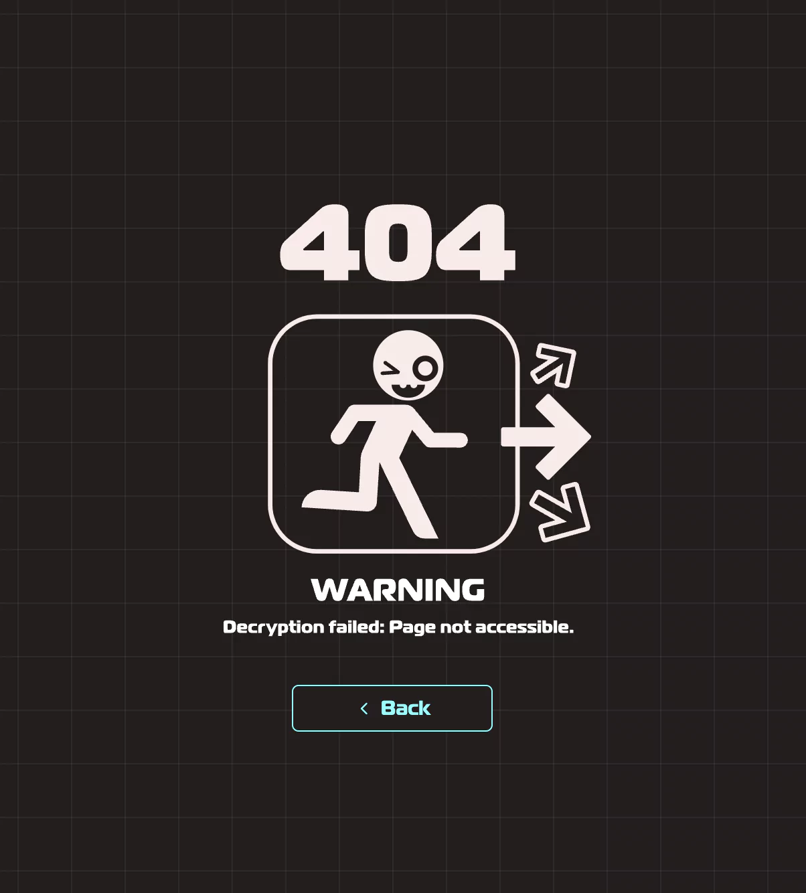

- The 404 Page showcases a full-screen background that aligns with the site's visual theme, reinforcing to users that they remain on the familiar site. Along with a message highlighting the page's unavailability, a conveniently placed button directs users back to the main menu, enhancing their user experience.

 

---

 

### Future Implementations

1. **Adding More Tiles**

   - As an additional layer of challenge, I could implement more tiles for the game beyond the current eight.

   - Depending on the difficulty level selected, the game could add more or fewer tiles to further enhance the experience and present an additional layer of challenge.

    

2. **Implement Score Tracker**

   - Implement a score system that rewards players for their skill.

   - Scores could be awarded based on how fast they match tiles together.

   - The selected difficulty could be used as a bonus multiplier, rewarding players who take on higher levels of difficulty and greater challenges.

    

3. **Implement Leaderboard**

   - Implement a scoreboard system that stores players' scores.

   - Users can input their name and be added to the leaderboard which could be viewed from the main menu or after a game is won.

   - This would encourage friendly competition between players, motivating them to solve the game faster each time, adding an additional layer of fun.

### Accessibility

**Using Semantic Elements** - The HTML is organized with semantic elements. This provides more clarity to the content, and enhances the experience for users with screen readers.

**Clean Sans-Serif Type** - The primary text on the website utilizes a sans-serif font. This choice aids individuals with dyslexia, ensuring they can easily read the content.

**Adaptive Font Scaling** - I've set the font sizes using REM units, which adjust according to the browser's base font size. This design decision means that those who need a larger font size, like people with vision challenges, can resize text without disrupting the website's structure.

**Reduced Motion Preference** - A specific CSS code has been integrated, responding to the prefers-reduced-motion media query. Users who opt for minimal motion will see animations disabled, creating a more comfortable and accessible environment for those who might find excessive animations disturbing.

**Aria Live Attribute** - In researching aria labels I learned that for elements that will change over time, like the life counter, would benefit from an aria-live attribute. This ensures that screen readers announce changes to these elements for the player.

 

## Technologies

### Programming Languages

- [HTML5](https://en.wikipedia.org/wiki/HTML5)
- [CSS3](https://en.wikipedia.org/wiki/Cascading_Style_Sheets)
- [JavaScript](https://en.wikipedia.org/wiki/JavaScript)

### Applications, Plugins & Tools Used

1. [Visual Studio Code](https://code.visualstudio.com/) - I used Visual Studio Code on my local machine as my preferred IDE for coding the HTML, CSS, and JavaScript. It aided in the development process of the project and helped in creating the README file using markdown.

2. [Figma](https://figma.com/) - I employed Figma to craft high-fidelity UI mockups during the UI/UX design planning phase. It also served in planning the website's design system and organizing UI elements into modular, reusable components. This facilitated a more structured approach to my CSS coding in later stages.

3. [Illustrator](https://www.adobe.com/ie/products/illustrator.html) - Given the website's extensive use of SVGs, Illustrator was crucial in helping to edit the vector files and import them to SVG format, allowing them to be integrated into the website.

4. [After Effects](https://www.adobe.com/ie/products/aftereffects.html) - I used After Effects to create the glitch video effects and to produce the text-falling matrix video, as seen on the victory screen when a player successfully completes a game.

5. [Git](https://git-scm.com/) - I used Git for version control, operating it from the terminal on my local machine. All changes were pushed to my remote repository on GitHub.

6. [GitHub](https://github.com/) - GitHub hosts my project remotely, making the source code accessible to others. I also deploy my site via GitHub Pages.

7. [Am I Responsive?](https://ui.dev/amiresponsive) - This tool displays how the website appears across various devices.

8. [Shields.io](https://shields.io/) - I utilized this service to integrate badges into the README.

9. [Adobe Fonts](https://fonts.adobe.com/) - Adobe Fonts was employed to import the 'Magerterial' font into the CSS stylesheet.

10. [Glow](https://www.figma.com/community/plugin/1078011857203492445/glow) - I used this Figma plugin to produce the glow effects seen in the wireframes.

11. [SVGOMG](https://svgomg.net/) - This online tool was used for compressing, cleaning, and optimizing my SVG files after exporting them from Illustrator.

12. [Tiny Img](https://tiny-img.com/webp/) - I utilized this platform to compress my images to a more optimal file size for web use and also to convert them to the contemporary .webp format.

13. [ChatGPT](https://chat.openai.com/) - This tool was instrumental in inspiring some of the website's text content. It was invaluable for checking spelling or grammatical inaccuracies and provided helpful suggestions to enhance the code I wrote, particularly regarding accessibility and suggesting good semantic class names.

 

## Deployment & Local Development

### Deployment

The site is deployed using GitHub Pages - [CyberCypher](https://shanedoyledev.github.io/cybercypher)

To deploy the site using GitHub Pages:

1. Login (or signup) to GitHub.
2. Go to the repository for this project: [ShaneDoyleDev/cybercypher](https://github.com/ShaneDoyleDev/cybercypher)
3. Click the settings button.
4. Select "Pages" in the left-hand navigation menu.
5. From the source dropdown, select the "main" branch and press save.

The site has now been deployed. Please note that this process may take a few minutes before the site goes live.

---

### Local Development

### How to Fork

To fork the repository:

1. Log in (or sign up) to GitHub.
2. Go to the repository for this project: [ShaneDoyleDev/cybercypher](https://github.com/ShaneDoyleDev/cybercypher)
3. Click the "Fork" button in the top right corner.

### How to Clone

To clone the repository:

1. Log in (or sign up) to GitHub.
2. Go to the repository for this project: [ShaneDoyleDev/cybercypher](https://github.com/ShaneDoyleDev/cybercypher)
3. Click on the "Code" button, select whether you would like to clone with HTTPS, SSH, or GitHub CLI, and copy the link shown.
4. Open the terminal in your code editor and change the current working directory to the location you want to use for the cloned directory.
5. Type `git clone` into the terminal and then paste the link you copied in step 3. Press enter.

### Committing and Pushing Changes

After making changes to your local copy, you can commit and push them to GitHub:

1. Open the terminal in the directory of your cloned repository.
2. Use `git status` to see the changes you've made.
3. Use `git add .` to stage all changes for commit, or `git add <filename>` to stage specific files.
4. Use `git commit -m "Your commit message here"` to commit your changes with a descriptive message.
5. Use `git push origin main` to push your changes to the main branch on GitHub.

 

## Testing

[Link to TESTING.md](TESTING.md)

## Credits

### Code Used And Tutorials

- [Memory Card Game - Javascript Tutorial](https://www.youtube.com/watch?v=ZniVgo8U7ek&t=34s) - This video tutorial from FreecodeCamp helped me figure out the general structure and core logic for matching tiles. Using this knowledge, I built upon the project further and developed a custom solution for my game.

- [Fisher-Yates Shuffle Algorithm](https://saturncloud.io/blog/how-to-randomize-shuffle-a-javascript-array/) - I implemented the Fisher-Yates shuffle algorithm as shown in this article to randomly shuffle the tiles every time the game board was generated. This function was placed into a separate utility module, which was then imported into my main script.

- [Prefers Reduced Motion](https://www.smashingmagazine.com/2021/10/respecting-users-motion-preferences/) - This article taught me about the "prefers-reduced-motion" media query. This understanding enabled me to enhance the accessibility of my website for those sensitive to motion-based media.

- [SVG Essentials & Animation, v2](https://frontendmasters.com/courses/svg-essentials-animation/) - This course from Sarah Drasner educated me on optimizing and working with SVG elements in browsers and how to animate them.

- [SVG Filters Crash Course](https://www.youtube.com/watch?v=n7y0y_8zTo4&t=427s) - This insightful presentation from Sara Soueidan delves into creating powerful effects in CSS using SVG filters. It was instrumental in guiding me to add a neon glow to the SVG elements.

- [CRT Screen Effect](http://aleclownes.com/2017/02/01/crt-display.html) - This article explains how to generate the CRT scanlines effect used to simulate a CRT monitor screen. I adapted the provided code for use in my own project.

- [Particle Matrix in After Effects](https://www.youtube.com/watch?v=pKMiTV55iho) - This tutorial allowed me to create the matrix code rain effect in After Effects and render it as a video that plays when the player successfully completes the game.

- [JavaScript Timer Bar](https://www.youtube.com/watch?v=WyAFGsY_fPw) - This tutorial assisted me in implementing the timer bar at the top of the game grid. I modified the code from the tutorial, leveraging ES6 JavaScript features, to enhance it for my codebase.

- [Colt Steele's Git And GitHub Course](https://www.udemy.com/course/git-and-github-bootcamp/) - As my project expanded, maintaining a clear git history became essential. The interactive rebase chapter was invaluable in helping me refactor previous commits, ensuring my project's long-term manageability.

### Content

Some of the text content on the website was written by me, while some were generated by ChatGPT, which I then edited and refined. ChatGPT was also used to help check for any potential spelling or grammatical errors in the text.

### Media

- [Vecteezy HUD Elements Set 1](https://www.vecteezy.com/vector-art/693917-hud-interface-elements) - These vector icons were used as tile elements for the game grid.

- [Vecteezy HUD Elements Set 2](https://www.vecteezy.com/vector-art/693919-hud-interface-elements) - These vector icons were used as tile elements for the game grid.

- [Vecteezy Eye Icons](https://www.vecteezy.com/vector-art/2882015-eye-icon-set-eyesight-symbol-retina-scan-eye-icons-simple-eyes-collection-eye-silhouette-free-vector) - I selected one of these icons for the instructions button in the menu.

- [Cyberpunk Decals Set](https://stock.adobe.com/ie/images/cyberpunk-motorsport-decals-set-set-of-vector-stickers-and-labels-in-futuristic-style-inscriptions-and-symbols-japanese-hieroglyphs-for-attention-high-voltage-warning-spec-racing/530439778) - I used many vectors from this set to design elements on the main menu and the 404 page.

### Acknowledgments

- My Mentor [Lauren-Nicole](https://github.com/CluelessBiker) - who offered excellent advice, provided solid feedback, and supported me during my work on this project.

- My Cohort Facilitator [Iris Smok](https://github.com/Iris-Smok) - for being helpful and supportive to me and all of my class members during the course.

- The Code Institute community - to both my class and the community in general. Having access to a wonderful community of people who are as passionate about coding as I am has greatly aided my coding journey so far.

- To you, dear reader, for taking the time to read my documentation. Have a cookie! 🍪

 

[Back to Top ^](#introduction)
