# CyberCypher - Testing Documentation

Visit the deployed site: [CyberCypher](https://shanedoyledev.github.io/cybercypher/)

## Table of Contents

- [Automated Testing](#automated-testing)
  - [HTML Validation](#html)
  - [CSS Validation](#css)
  - [Javascript Validation](#javascript)
  - [LightHouse](#lightHouse)
  - [Accessibility](#accessibility)
- [Manual Testing](#manual-testing)
  - [Devices](#devices)
  - [Browsers](#browsers)
  - [Responsiveness](#responsiveness)
  - [User Stories Testing](#user-stories-testing)
  - [Feature Testing](#feature-testing)
- [Bugs](#bugs)
  - [Bugs Encountered](#bugs-encountered)
  - [Solved Bugs](#solved-bugs)

### Automated Testing

#### Validator Testing

#### HTML Validation

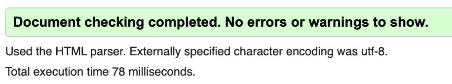

[W3C Markup Validation Service](https://validator.w3.org/nu/?doc=https%3A%2F%2Fshanedoyledev.github.io%2Fcybercypher%2F) - On initial submission, I received error messages indicating that some of my images were missing 'alt' attributes. Therefore, I added them. I was also informed that my script could not have a 'defer' attribute as it was a module. I relocated it to the bottom of the body tag, allowing it to load after the HTML content. After these adjustments, the validation passed without any errors.

#### CSS Validation

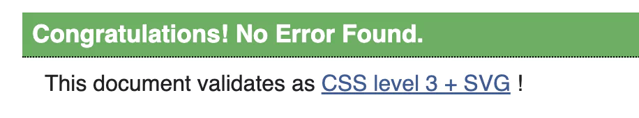

[W3C Jigsaw CSS Validation Service](https://jigsaw.w3.org/css-validator/validator?uri=https%3A%2F%2Fshanedoyledev.github.io%2Fspacefruit%2F&profile=css3svg&usermedium=all&warning=1&vextwarning=&lang=en) - No errors were identified when validated through the official (Jigsaw) validator.

#### Javascript Validation

### 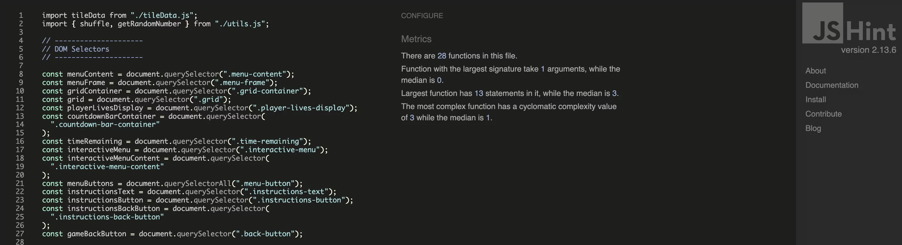

[JSHint](https://jigsaw.w3.org/css-validator/validator?uri=https%3A%2F%2Fshanedoyledev.github.io%2Fcybercypher%2F&profile=css3svg&usermedium=all&warning=1&vextwarning=&lang=en) - When I ran my JavaScript through JSHint, the only two errors I encountered were advice to avoid using short-circuit evaluation in two conditionals, and to refrain from using optional chaining, which is a newer ES11 feature of the language. After refactoring my codebase to utilize 'if' statements instead, my code passed without any errors.

---

#### LightHouse

Lighthouse was used within Chrome Developer Tools to test the performance, accessibility, best practices, and SEO of the website.

#### Initial Desktop Ranking

This is my initial Lighthouse ranking for the desktop version.

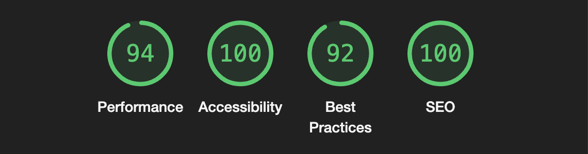

#### Initial Mobile Ranking

This is my initial Lighthouse ranking for the mobile version.

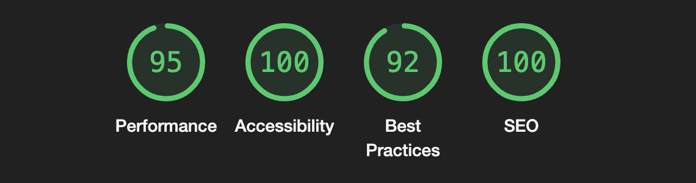

#### Improvements

I was satisfied with my performance rating but wanted to investigate further what was causing the lower scores for both the best practices and performance sections.

- Performance - Lighthouse informed me that I should "Ensure text remains visible during webfont load." Upon researching this, I found that it highlights a performance and user experience issue where webfonts can cause a flash of invisible text (FOIT) or a flash of unstyled text (FOUT) when a page is loading. Setting the font display from block to swap fixed this issue.

- Best Practices - I received feedback that some of my images did not have a clearly defined width and height. Therefore, I made sure to set them as attributes in the HTML img tags. This is done to help prevent cumulative layout shift when the page first loads.

#### Final Lighthouse Score

- I was delighted to see that when I addressed these issues, I was able to push my ranking to a perfect score!

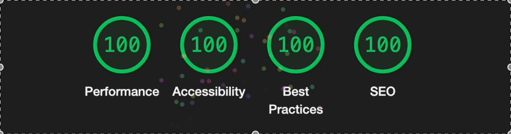

 

---

- ### Accessibility

    
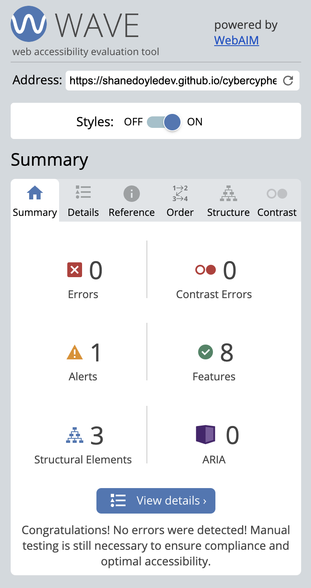

[Wave](https://wave.webaim.org/report#/https://shanedoyledev.github.io/cybercypher/) - When I ran my website through the WAVE tool I saw that it had passed validation with zero errors or contrast issues.

 

---

### Manual testing

#### Devices

Below are the various devices and browsers I tested my website on after it was deployed.

- 13-inch MacBook Pro
- 11 inch iPad Pro
- iPhone 13

#### Browsers

- Google Chrome
- Firefox
- Safari
- Edge

| Testing                  | Chrome | Firefox | Safari | Edge | Notes                                                                                                     |
| ------------------------ | ------ | ------- | ------ | ---- | --------------------------------------------------------------------------------------------------------- |
| Intended Appearance?     | Good   | Good    | Fair   | Good | Safari had issues loading the videos correctly, and the first letter of the SVG title was not displaying. |
| Intended Responsiveness? | Good   | Good    | Good   | Good | Layout functioned well and was responsive across all browsers.                                            |

#### Responsiveness

##### Main Menu Section

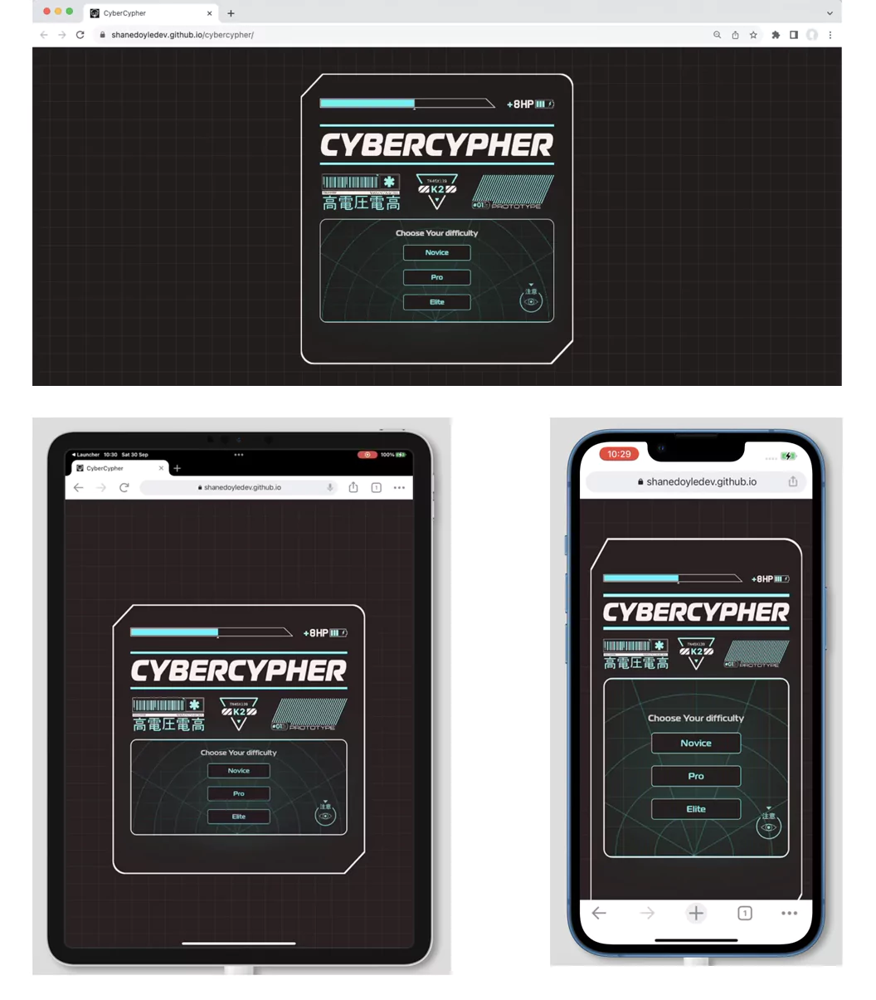

 

##### Game Grid Section

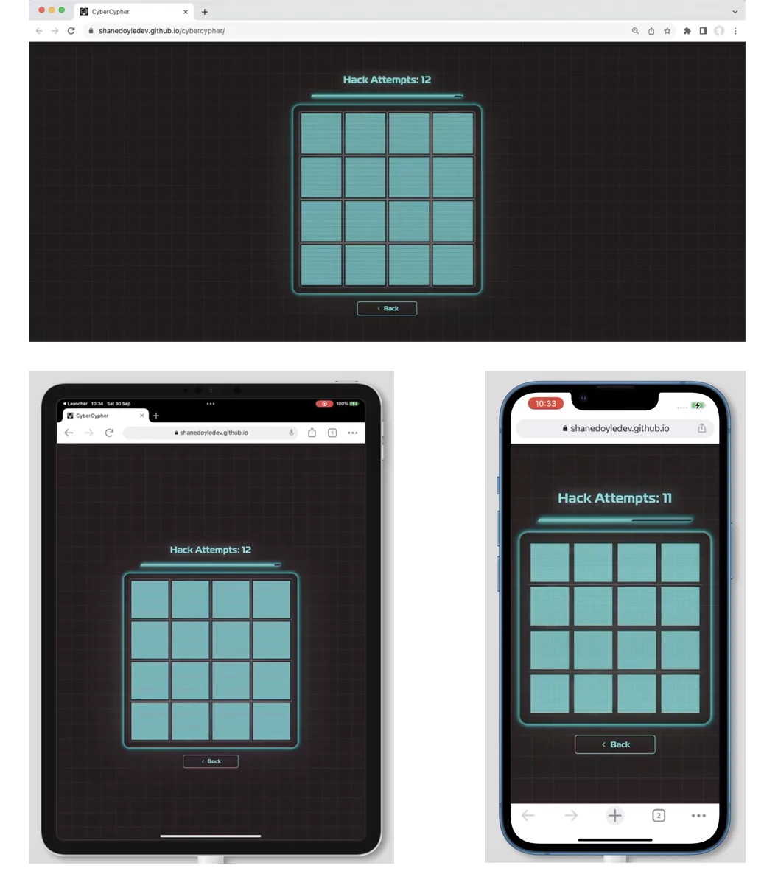

#### User Stories Testing

`Player Goals`
| Player Goals | How are they achieved? |
| :----------------------------------------------------------------------------------------------------------------------------------------------------- | :---------------------------------------------------------------------------------------------------------------------------------------------------------------------------------------------------------------- |
| 1. As a player, I want to be able to choose a game difficulty (novice, pro, elite) from the main menu so that I can tailor the game to my skill level. | Implemented an interactive menu that allows players to select the desired difficulty level from three game difficulty modes. |
| 2. As a player, I want to see that the game matches the cyberpunk aesthetic and fits with the hacker theme. | Designed the UI and in-game assets to follow a cyberpunk aesthetic. Used appropriate fonts, colors, and artwork to ensure thematic consistency. |
| 3. As a player, I want a visual timer to be displayed on the screen so that I can see how much time I have left to complete the game. | Added a countdown timer on the game screen that visually depletes as time runs out. Also flashes as a warning before it is about to become empty. |
| 4. As a player, I want to know if two tiles match or not, and if they do, I want them to stay revealed. | Implemented the game logic to compare the selected tiles. If they match, they remain face up. If not, they flip back after a short delay which is signified by a glitch animation. |
| 5. As a player, I want to see my number of lives displayed on the screen so I know how many attempts I have left. | Displayed a life counter on the game screen representing the number of hack attempts. This counter is updated every time a player loses a life. |
| 6. As a player, I want the game to end and see a game over screen if I run out of lives before completing the game. | Implemented the game logic to detect when the player's lives reach zero and then transition to a game over screen. The screen offers the player a chance to play again without having to return to the main menu. |
| 7. As a player, I want the game to end and see a victory screen if I successfully match all the tiles before running out of time or lives. | Implemented the logic to monitor and check the game state. If all tiles are matched before the timer runs out or lives deplete, a victory screen is displayed with a nice animation for the player as a reward. |
| 8. As a player, I want the option to restart the game from the victory or game over screen so that I can play again. | Added a "Restart" button on both victory and game over screens that reset the game state and allow players to play again. |
| 9. As a player, I want to see dynamic visual effects to make the experience more immersive. | Incorporated animations and visual effects, such as neon glows, flickers, scanlines, and transitional glitch animations for a more engaging player experience. |
| 10. As a player, I want to be able to access game instructions from the main menu to understand how to play the game. | Implemented an "Instructions" button on the main menu that switched the menu to reveal the game instructions that clearly explain the rules to the player. |
| 11. As a player, I want the ability to return to the main menu from the game screen so that I can change the game difficulty or access instructions. | Included a back button on the game screen which lets players navigate back to the main menu easily. |
| 12. As a player, I want to be able to play the game on a variety of screen sizes and devices, from large to small. | Designed the game using responsive design principles to ensure compatibility and adjustability across various screen sizes and devices. |

---

#### Feature Testing

 

`Favicon `
| Feature | Expected Outcome | Testing Performed | Result | Pass/Fail |
| --------------------------- | --------------------------------------------------------------------------------------------- | ------------------------------- | ----------------------------------------------------- | --------- |
| Favicon | Loads in the browser tab when the website is opened | Open website | Favicon is correctly shown | Pass ✅ |

 

`Main Menu Section`
| Feature | Expected Outcome | Testing Performed | Result | Pass/Fail |
| ---------------------------- | -------------------------------------------------------------------- | ----------------- | ------------------------ | --------- |
| Main Menu Background | Image is shown | Load website | Image correctly loads | Pass ✅ |
| Main Menu Section Background | Background image covers and remains centered over all section widths | Resize browser window | Background image remains centered and covers all widths | Pass ✅ |
| Loading Bar Image | Image is shown | Load website | Image correctly loads | Pass ✅ |
| Loading Bar Image | Image is responsive to changing widths | Resize browser window | Image is responsive | Pass ✅ |
| Battery Meter Image | Image is shown | Load website | Image correctly loads | Pass ✅ |
| Battery Meter Image | Image is responsive to changing widths | Resize browser window | Image adjusts to different widths | Pass ✅ |
| Cybercypher Title | Image is shown | Load website | Image correctly loads | Pass ✅ |
| Cybercypher Title | Image is responsive to changing widths | Resize browser window | Image is responsive | Pass ✅ |
| Barcode Image | Image is shown | Load website | Image correctly loads | Pass ✅ |
| Barcode Image | Image is responsive to changing widths | Resize browser window | Image is responsive | Pass ✅ |
| Triangle Image | Image is shown | Load website | Image correctly loads | Pass ✅ |
| Triangle Image | Image is responsive to changing widths | Resize browser window | Image is responsive | Pass ✅ |
| Prototype Image | Image is shown | Load website | Image correctly loads | Pass ✅ |
| Prototype Image | Image is responsive to changing widths | Window resize | Image is responsive | Pass ✅ |

 

`Interactive Menu Section`
| Feature | Expected Outcome | Testing Performed | Result | Pass/Fail |
| ----------------------- | -------------------------------------------------------------------- | ----------------- | --------------------------- | --------- |
| Radar Background Image | Image is shown | Load website | Image correctly loads | Pass ✅ |
| Radar Background Image | Background image covers and remains centered over all menu widths | Resize browser window | Background image remains centered and covers all widths | Pass ✅ |
| Novice Play Button | Starts game with correct life and timer values for chosen difficulty | Button click | Game starts with correct state | Pass ✅ |
| Novice Play Button | Background changes in hover | Button hover | Background color changes | Pass ✅ |
| Pro Play Button | Starts game with correct life and timer values for chosen difficulty | Button click | Game starts with correct state | Pass ✅ |
| Pro Play Button | Background changes in hover | Button hover | Background color changes | Pass ✅ |
| Elite Play Button | Starts game with correct life and timer values for chosen difficulty | Button click | Game starts with correct state | Pass ✅ |
| Elite Play Button | Background changes in hover | Button hover | Background color changes | Pass ✅ |

 

`Instructions Section`
| Feature | Expected Outcome | Testing Performed | Result | Pass/Fail |
|---------------------------|---------------------------------------------------------------------------|----------------------------|------------------------------------------------------|-----------|
| Instructions Menu Button | Image and text display next to each other on desktop sizes | Resize browser window | Image and text display as intended on desktop | Pass ✅ |
| Instructions Menu Button | Arrow pointer animates in a loop above the button | Load image | Arrow correctly animates | Pass ✅ |
| Instructions Text | Text is shown to the player | Instructions button clicked | Text is displayed as intended on mobile | Pass ✅ |
| Instructions Text | Text is resized on smaller screen widths | Resize browser window | Text is displayed as intended on mobile widths | Pass ✅ |
| Glitch Transition | Video loads correctly when instructions button is pressed | Click instructions button | Video loads and plays correctly | Pass ✅ |
| Glitch Transition | Video loads correctly when back button is pressed | Click back button | Video loads and plays correctly | Pass ✅ |

 

`Countdown Bar`
| Feature | Expected Outcome | Testing Performed | Result | Pass/Fail |
| -----------------| ----------------------------------------------------------- | ----------------------- | ------------------------------------- | --------- |
| Countdown Bar | Countdown bar displays on game load | Start game | Countdown bar displays as intended | Pass ✅ |
| Countdown Bar | Countdown bar shrinks and expands to accommodate changing browser widths | Resize browser window | Countdown bar is responsive | Pass ✅ |
| Countdown Bar | Glow animation effect on the bar is shown | Start game | Countdown bar glow effect is shown | Pass ✅ |
| Countdown Bar | Inner width of the bar representing the time remaining begins to decrease with the timer countdown | Start game and allow time to pass | Countdown bar inner width begins to decrease | Pass ✅ |
| Countdown Bar | When 25% of the time is remaining, the countdown bar starts to flash as a warning | Allow time remaining to fall below 25% | Countdown bar begins to flash | Pass ✅ |
| Countdown Bar | Game ends, and the game over screen plays when the countdown bar is empty | Allow time remaining to reach zero | Game ends, and game over screen plays | Pass ✅ |
| Countdown Bar | Timer resets when the player presses the restart button | Click reset button after game ends | Countdown bar resets to full | Pass ✅ |

 

`Life Meter`
| Feature | Expected Outcome | Testing Performed | Result | Pass/Fail |
| --------------- | ---------------------------------------------- | ---------------------------------- | ------------------------------------ | --------- |
| Life Meter | Shows 12 hack attempts on novice mode | Click novice button in main menu | Shows 12 hack attempts | Pass ✅ |
| Life Meter | Shows 8 hack attempts on pro mode | Click pro button in main menu | Shows 8 hack attempts | Pass ✅ |
| Life Meter | Shows 5 hack attempts on elite mode | Click elite button in main menu | Shows 5 hack attempts | Pass ✅ |
| Life Meter | Decrements attempts by one when tiles do not match | Mismatch two tiles in game | Decrements attempts number by one | Pass ✅ |
| Life Meter | Game over screen is shown when attempts number reaches zero | Reach zero hack attempts | Game over screen is shown | Pass ✅ |
| Life Meter | Resets back to the initial value on game restart | Click restart button in game | Resets attempts number to initial value | Pass ✅ |

 

`Grid Tile`
| Feature | Expected Outcome | Testing Performed | Result | Pass/Fail |
| --------------- | ------------------------------------------------------------ | ---------------------------------- | --------------------------------------- | --------- |
| Grid Tile | Back face image loads correctly | Start game | All back face images load correctly | Pass ✅ |
| Grid Tile | Front face image loads correctly | Start game | All front face images load correctly | Pass ✅ |
| Grid Tile | A random front face is shown each time the game starts | Start game | All front faces are randomly shuffled | Pass ✅ |
| Grid Tile | Load front face SVG image | Reveal front face image on click | Icon shows SVG glow effect | Pass ✅ |
| Grid Tile | User is prevented from clicking on the same tile twice | Click on the same tile twice | Tile cannot be clicked on | Pass ✅ |
| Grid Tile | When two tiles match, they stay revealed to the player | Match two tiles | Matching tiles remain revealed on the board | Pass ✅ |
| Grid Tile | Click handler is removed on tile match | Match two tiles | Matching tiles can no longer be clicked on | Pass ✅ |
| Grid Tile | Glitch video transition effect plays for 300ms | Click grid tile | Glitch video plays for 300ms | Pass ✅ |

 

`Game Grid`
| Feature | Expected Outcome | Testing Performed | Result | Pass/Fail |
|------------|------------------------------------------------------------------------------|-------------------------|-----------------------------------------------------------------|-----------|
| Game Grid | 16 grid tiles are generated and appended to the game board when the game starts | Start game | All 16 grid tiles load correctly | Pass ✅ |
| Game Grid | Game tiles are laid out in a 4 x 4 grid | Start game | Grid tiles are laid out correctly | Pass ✅ |
| Game Grid | Game grid and tiles shrink and expand fluidly to accommodate smaller screen widths | Resize browser window | Game grid and tiles resize fluidly for different screen widths | Pass ✅ |
| Game Grid | When two mismatched cards are revealed, prevent the user from clicking on the game grid for a timeout duration of 1 second | Mismatch two cards | Grid temporarily prevents the player from clicking on it for one second | Pass ✅ |
| Game Grid | Border of the game grid shows a neon glow effect | Start game | Border correctly shows the neon glow effect | Pass ✅ |

 

`Victory Screen`
| Victory Screen | Expected Outcome | Testing Performed | Result | Pass/Fail |
| -------------------- | ------------------------------------------------------------------------- | --------------------- | ----------------------------------------- | --------- |
| Victory Screen | Victory Screen displays when player matches all cards within time limit | Win the game | Victory Screen is displayed correctly | Pass ✅ |
| Background Video | Matrix effect video plays in the background during Victory Screen display | Show Victory Screen | Matrix effect video displays correctly | Pass ✅ |
| Access Granted Image | "Access Granted" image displays | Win the game | "Access Granted" image displays correctly | Pass ✅ |
| Access Granted Image | "Access Granted" image is responsive to various screen widths | Resize browser window | "Access Granted" image remains responsive | Pass ✅ |
| Restart Button | Restart button displays correctly on the Victory Screen | Show Victory Screen | Restart button displays correctly | Pass ✅ |
| Restart Button | Game restarts when the Restart button is clicked | Click Restart button | Game restarts correctly | Pass ✅ |

 

`Game Over Screen`
| Feature | Expected Outcome | Testing Performed | Result | Pass/Fail |
| --------------------- | ------------------------------------------------------------ | ---------------------------------- | --------------------------------------- | --------- |
| Game Over Screen | Game Over Screen plays when the player's number of attempts falls to zero | Let lives fall to zero | Game Over Screen is shown correctly | Pass ✅ |
| Game Over Screen | Game Over Screen plays when the timer runs out | Let timer run out | Game Over Screen is shown correctly | Pass ✅ |
| Warning Triangle Image | Warning triangle image is shown | Show Game Over Screen | Warning triangle image is shown correctly | Pass ✅ |
| Warning Triangle Image | Warning triangle image is responsive to different screen widths | Resize browser window | Warning triangle image is responsive | Pass ✅ |
| Warning Triangle Image | Warning triangle image has flashing animation | Show Game Over Screen | Warning triangle image flashing animation is shown correctly | Pass ✅ |
| Restart Button | Restart button is correctly shown in the Game Over Screen | Show Game Over Screen | Game restart button is correctly shown | Pass ✅ |
| Restart Button | Game restarts when the Restart button is clicked | Click Restart button | Game correctly restarts | Pass ✅ |

 

`404 Page`
| Feature | Expected Outcome | Testing Performed | Result | Pass/Fail |
| ------------------------- | ------------------------- | ------------------- | ---------------------------------- | --------- |
| 404 Page | Incorrect URL redirection | Enter incorrect URL | Successful redirection to 404 page | Pass ✅ |
| 404 Page background image | Image loads successfully | Open website | Images load correctly | Pass ✅ |
| 404 Page background image | Background image covers and remains centered over all section widths | Window resize | Background image remains centered and covers all widths | Pass ✅ |
| 404 Page homepage link | Redirected to homepage | Clicked Link | Redirected back to homepage | Pass ✅ |

---

### Bugs

## Bugs Encountered

### 1. **Glitch Video Not Playing on Certain Tiles**

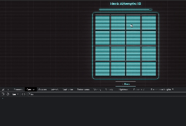

 

Upon interacting with the tiles, it was observed that the glitch effect video did not consistently play as intended.

### 2. **Broken Victory and Game Over Images on Deployment**

    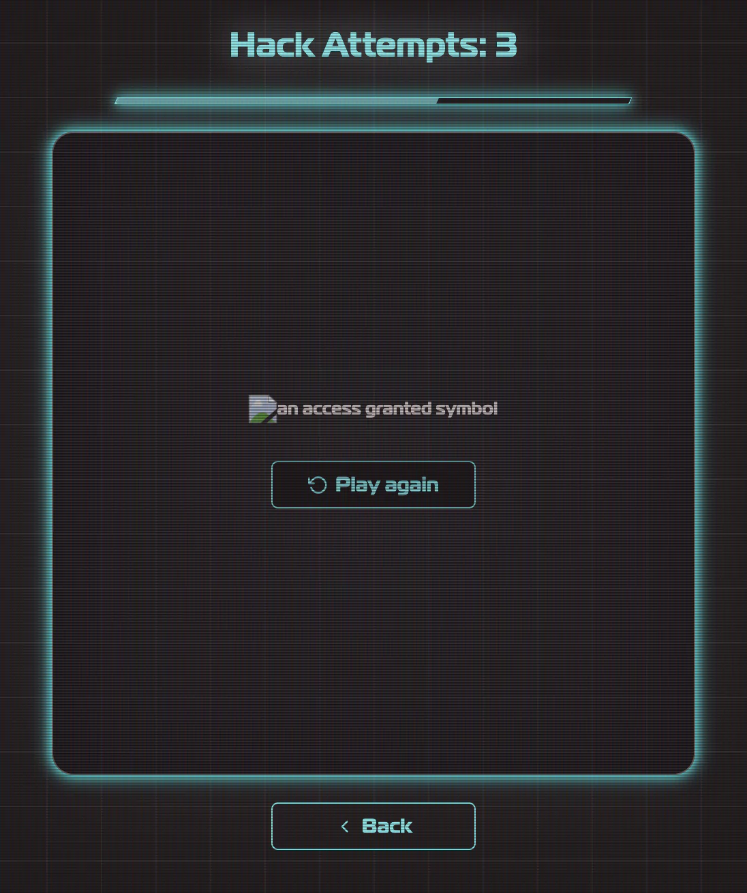
    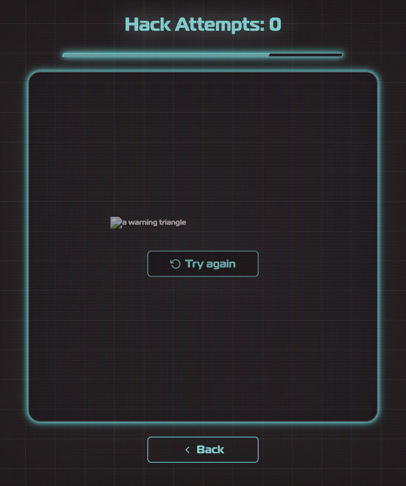

 

During the deployment process on GitHub Pages, the images designated for the victory and game over screens failed to display.

### 3. **Broken 404 Page Link on Deployment**

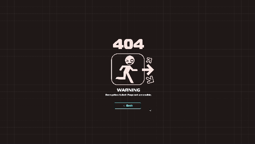

 

When the site was deployed to GitHub Pages, the link did not redirect users back to the main menu.

### 4. **Multiple Tiles Could Be Selected**

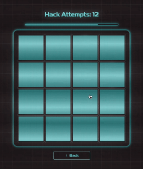

 

When testing the game, I found there was a bug where the player could select more than two tiles at a time. I wanted to ensure that only two tiles could be selected at any one time to check for a match and that no other tiles could be selected until a match was confirmed.

## Solved Bugs

### 1. **Glitch Video Not Playing on Certain Tiles (Solved)**

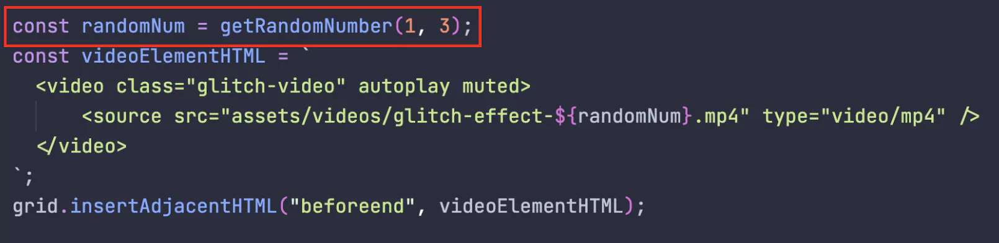

Using the developer tools, it was identified from the console that the random number generator function was outputting integers outside the desired range. This led to JavaScript appending video elements with inaccurate prefix numbers. Rectifying this by adjusting the range to 1-3 solved the issue.

 

### 2. **Broken Victory and Game Over Images on Deployment (Solved)**

    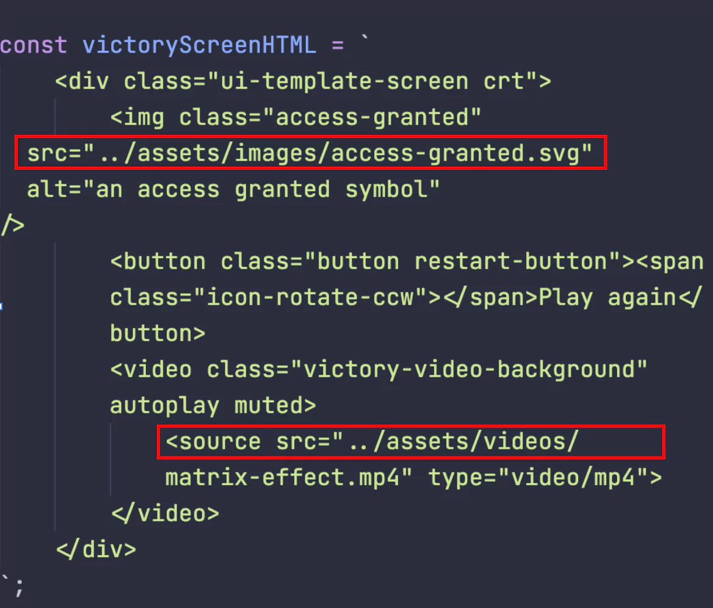

An investigation revealed that the file paths specified in the HTML UI template strings within the main.js file were relative. Modifying them to absolute paths starting from the root directory ensured their proper sourcing when the site was deployed on GitHub Pages.

 

### 3. **Broken 404 Page Link on Deployment (Solved)**

    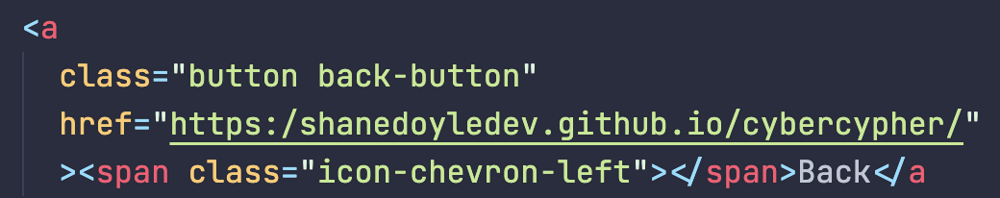

A review highlighted that the URL was missing an additional `/` past the colon, within the protocol section of the URL. Addressing this resolved the underlying problem.

 

### 4. **Multiple Tiles Could Be Selected (Solved)**

    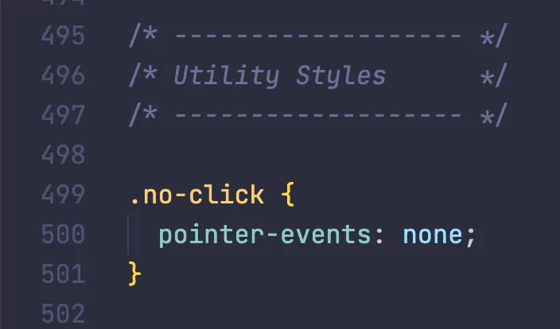

 

To address this bug, I introduced a `.no-click` utility class in CSS, which effectively disabled the `pointer-events` property on the tile element, preventing users from clicking on it. When a tile was selected, I ensured it couldn't be selected again by appending this class. Additionally, during the match-checking process, I temporarily applied this class to the grid to block interactions with other tiles, ensuring that only two tiles could be revealed on the board at any given moment.

 

[Back to Top ^](#cybercypher---testing-documentation)
